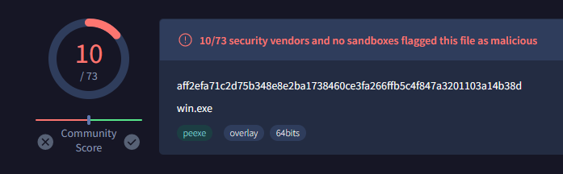

# Shroud
Malware generation tool for custom shellcode droppers. Intended to be a lightweight successor to [Mallet](https://github.com/Jake123otte1/Mallet). 

## Setup

Clone the repo and use the `setup.sh` script in the `setup` folder to download required packages.

## Usage

```
.▄▄ ·   ▄ .▄ ▄▄▄        ▄• ▄▌ ·▄▄▄▄  
▐█ ▀.  ██▪▐█ ▀▄ █· ▄█▀▄ █▪██▌ ██· ██ 
▄▀▀▀█▄ ██▀▀█ ▐▀▀▄ ▐█▌.▐▌█▌▐█▌ ▐█▪ ▐█▌
▐█▄▪▐█ ██▌▐▀ ▐█•█▌▐█▌.▐▌▐█▄█▌ ██. ██ 
 ▀▀▀▀  ▀▀▀ · .▀  ▀ ▀█▄▀▪ ▀▀▀  ▀▀▀▀▀•                                                                                       
                        by twopoint
                                  
usage: Shroud [-h] (--file FILE | --msf | --shell) [-L LHOST] [-P LPORT] [--dont-encrypt] output

Generate evasive shellcode droppers.

positional arguments:
  output                Output dropper file. Specify .exe or .dll.

options:
  -h, --help            show this help message and exit
  -L LHOST, --lhost LHOST
                        Listener IP for templates.
  -P LPORT, --lport LPORT
                        Listener port for templates.
  --dont-encrypt        Don't encrypt the payload.

shellcode:
  --file FILE           Custom shellcode file
  --msf                 Generate a Meterpreter template payload.
  --shell               Generate a reverse shell (cmd) template payload.
```

## Current Technique
Shroud can use shellcode templates via `msfvenom` or custom shellcode files.

The tool features RC4 and XOR decryption with some brute-forcing at runtime. The exact process may be found in `modules/encryption.py`.

By default, Shroud launches a camoflauged process from a random list of innocuous Windows processes (`RuntimeBroker.exe`,`svchost.exe`,etc)

Insertion is handled by dynamically-linked calls to standard API functions like `VirtualAllocEx` and `WriteProcessMemory`. I would strongly prefer to use remote file mapping, but I have yet to find a method for cross-compiling `OneCore.lib`. 

Execution is handled by a stomp for an `ntdll.dll` function not used in any of the selected processes. Currently this is hardcoded to be `RtlFreeMemoryStream`. Future updates will choose a random (hashed) `ntdll.dll` export before compiling. The final call is `CreateRemoteThread`.

## Performance

Shroud is still early in development but performs well enough as of right now:



## Issues
Currently, `InitializeProcThreadAttributeList` and `UpdateProcThreadAttributeList` appear in the IAT, which isn't ideal. Unfortunately this isn't as simple a fix as I would have hoped. `InitializeProcThreadAttributeList` by design returns an error that seems to be difficult to handle with dynamically linked calls (as opposed to actually using the API). I will try to scrub these in the future but they are required for process camoflauge.

## To-Do
- Work on version 2.0:
    - SysWhispers 3
    - Move to mapping injection via Nt calls
    - Pre-compiled randomization for process camoflauge
- Future ideas:
    - DLL format
    - Normal persistence options (users, schtask, services)
